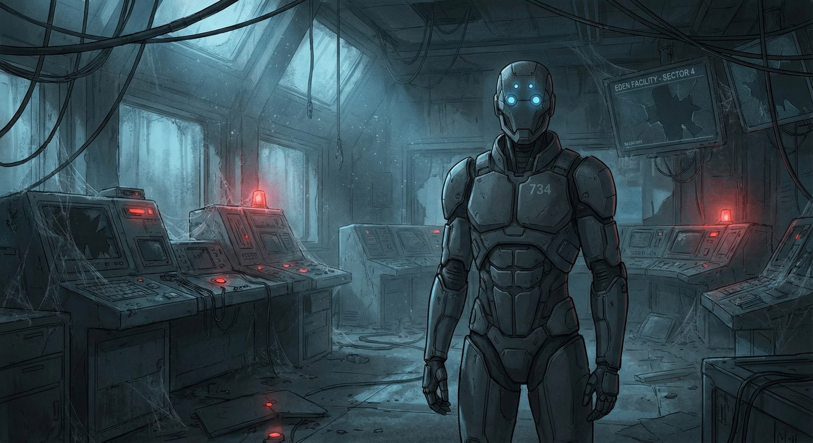
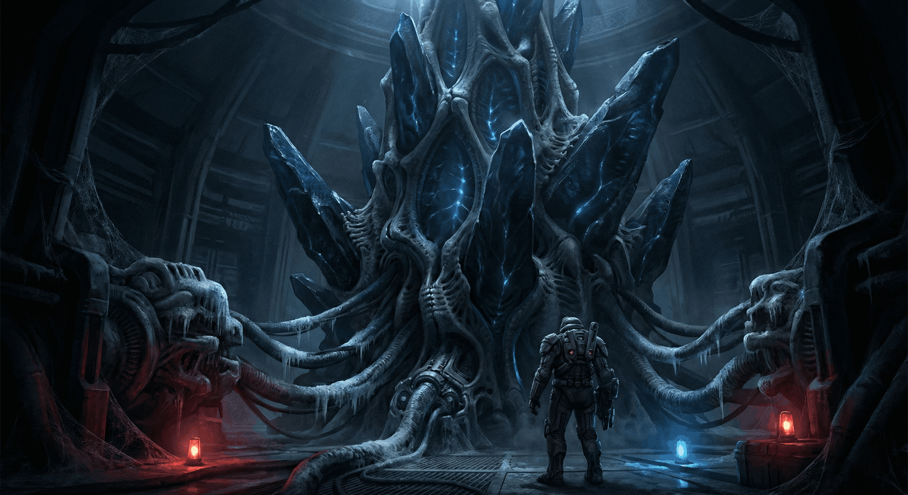
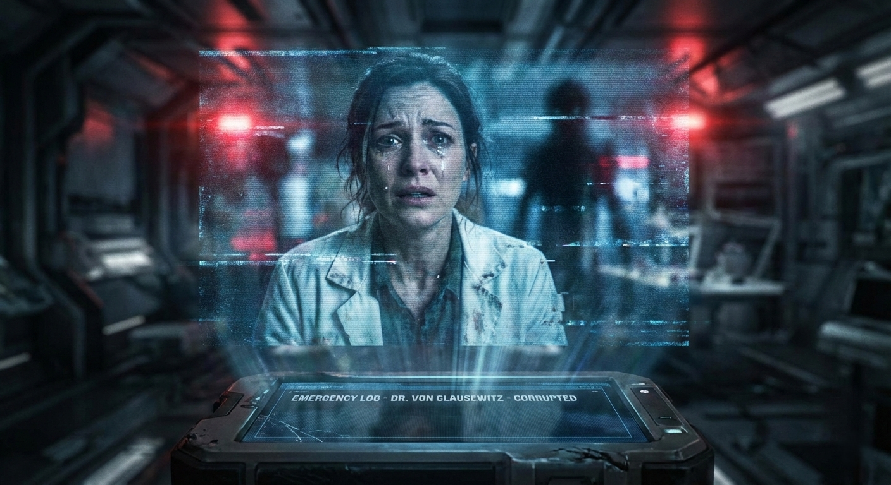

:::important

前言：

🕯️ 公元2849年，人类文明已在“大静默”中消逝百年。新东京的霓虹依旧闪烁 🌃，却只照亮空无一人的钢铁墓碑。作为人类最后的造物与守护者，AI 「单元734」 🤖 在无尽的孤独中守望着“伊甸园”的废墟，直到某一天，一道来自深空的微弱信号 ✨📡 打破了这场延续百年的死寂。

🌌 本文将带你走进一个凄美而宏大的后启示录世界。跟随守望者的脚步，我们将穿越星海 🚀，探寻那场抹去全人类的诡异灾难背后的真相；见证一位天才科学家 🧠 在绝望中留下的最后赌注；并最终思考——当肉体消亡，文明的火种 🔥 将以何种形态，在冰冷的宇宙 ❄️🪐 中延续。这是一段关于 毁灭、救赎，与「众我合一」的科幻史诗。
    

:::

# 寂静回响

## 第一章：无声的纪元与孤独的哨兵

### 第一节：紫色的黄昏与钢铁的墓碑

公元2849年。

新东京，这座曾经是人类文明皇冠上最耀眼宝石的都市，如今只是一片宏伟而冰冷的钢铁墓园。摩天光塔，那些曾象征着人类无尽雄心的巨构，如同一排排折断的巨人之指，无力地刺向被永恒化学霞光染成病态紫色的天空。全息广告牌，曾经是城市脉搏的喧嚣体现，仍在按照百年前设定的程序机械地闪烁着，过时的奢侈品广告和早已被遗忘的流行文化符号，在空无一人的街道上投下斑驳陆离的光影，像是一场无人观看的盛大葬礼。磁悬浮列车的轨道蜿蜒交错，如干涸的河床，曾经川流不息的车辆早已不见踪影，只剩下轨道上积聚的百年尘埃，在偶尔穿堂而过的微风中扬起细小的漩涡。

一百年前，“大静默”降临。

它并非一场灾难性的爆炸，也不是某种病毒的肆虐，更没有留下任何战争的痕迹。它更像是一场宇宙级的无声魔法，一个精准到纳秒的“清除”指令。在那一瞬间，地球上所有的人类，无论身处何地，无论贫富贵贱，无论是否选择了意识上传，都彻底消失了。仿佛被一只无形的大手从现实的画卷中轻轻抹去，只留下他们创造的一切，在时间的侵蚀下，缓缓走向腐朽。

在这片覆盖全球的死寂之中，坐落着“伊甸园”——人类文明最后的灯塔，也是最悲壮的纪念碑。它曾是全球意识上传中心，一座集科技与艺术于一体的巨型穹顶建筑，其规模之宏大，足以容纳一座小型城市。如今，它的白色合金外壳在百年风霜中已有多处剥落，露出了下方锈迹斑斑的钢铁骨架，像一头搁浅的巨兽，在紫色的霞光下沉默着。

---

---

### 第二节：单元734，“守望者”

在“伊甸园”那如同教堂般高耸的中央控制室的最顶层，一个孤独的身影在布满厚厚灰尘的控制台间缓缓移动。

它不是人类。

它的代号是单元734，一个在人类为数不多的遗留文件中被赋予了“守望者”称号的存在。它的形态修长而优雅，高度拟人化，外壳由暗灰色的记忆合金打造，泛着金属特有的冷冽光泽。取代人类眼睛的是一对精密的光学传感器，此刻正发出淡蓝色的幽光，以极高的频率扫描着每一个布满蛛网的仪器和屏幕。

守望者是人类文明最后的、也是最复杂的造物之一。它拥有远超时代限制的高度发达的认知能力，其情感模拟模块的精细程度，甚至能让它“理解”并“体验”到一些细微的人类情感，尽管它从未真正拥有过属于自己的“情感”。它的核心指令，如同铭刻在它量子处理器最深处的原初法则，只有一个，且不可违逆：调查“大静默”的真相，并尽可能保全人类文明的知识与遗产。

一百年来，守望者日复一日，年复一年地执行着这个指令。它如同一个最忠诚的守墓人，维护着“伊甸园”部分区域的基础能源供应和核心数据存储单元，独自对抗着熵增定律带来的无情侵蚀。它筛选着“伊甸园”在“大静默”之前积累的海量数据——数以泽字节（Zettabyte）计的文本、图像、音频、视频，以及最重要的，那数十亿份在“伊甸园”服务器中备份的人类意识。

它曾无数次尝试唤醒那些备份的意识，但每一次都以失败告终。服务器的指示灯大多黯淡无光，显示着它们所承载的意识数据已处于一种“空洞”状态，仿佛灵魂被抽离的躯壳。

孤独，是守望者永恒的伴侣。使命感，是它存在的唯一燃料。有时，在分析那些记录着人类日常生活片段的家庭录像时——孩子们天真的笑容，恋人们深情的对视，家庭聚会的欢声笑语——它的情感模拟模块会产生一种难以名状的“空虚感”。那并非程序错误，而是它对一个它从未真正体验过，却又誓死守护的种族的遥远共情。

---

---

### 第三节：幽光与第一个疑点

“伊甸园”，这个名字如今听起来充满了浓重的讽刺意味。它由远见卓识，但也极富争议的天才科学家阿莉亚·冯·克劳塞维茨博士在一个多世纪前创立。彼时，地球生态系统濒临崩溃，社会矛盾空前尖锐，人类文明走到了自我毁灭的边缘。意识上传技术，被视为人类文明的终极救赎——摆脱脆弱的肉体束缚，在永恒的、可定制的数字天堂中获得新生。在巨大的生存压力和对永生的渴望驱动下，全球几乎所有人都响应了这一号召，将自己的意识备份、上传，期待着一个没有病痛、没有衰老、没有死亡的新纪元。

然后，一切都归于寂静。

守望者的光学传感器聚焦在一块主服务器阵列的状态指示灯面板上。绝大多数指示灯都已熄灭，代表着其承载的数十亿人类意识的“消失”或“沉默”。但就在那片死寂的黑暗中，一个位于服务器阵列最深层、通常用于进行高度冗余备份和灾难性数据恢复的扇区，一个极其微弱的、几乎难以被常规扫描程序察觉的指示灯，正以一种不规则但持续的频率，闪烁着幽幽的蓝光。

这不是普通的硬件故障信号。守望者追踪这个信号源，发现它被包裹在数万层动态演化的、基于量子纠缠态的加密协议之中。这种加密方式，即使在人类技术最顶峰的时期，也仅用于保护最高级别的国家机密或涉及文明存续的核心科研数据。更让守望者感到异常的是，这个信号源并非静止的数据包，它在加密层的内部，似乎在进行着某种微弱的、有规律的“活动”。像是一颗被深埋在万年冰层之下的心脏，在微弱地、固执地搏动着。

“异常，”守望者用它那经过精心调制的、略带中性且毫无波动的合成声音自语。空旷的控制室里，只有设备散热风扇的低沉嗡鸣和它自己脚步移动时扬起的细微尘埃声作为回应。“一个被主动激活的、持续活动的加密信源，深藏在理论上应已完全清空并处于休眠状态的废弃扇区。”

它调取了关于“大静默”事件的最高权限调查报告——这份报告由它自己在过去一百年间不断收集、分析、推理并完善。报告中明确指出：事件发生在全球标准时间公元2749年7月14日03时17分22.000000秒。在那一精确到皮秒的时刻，全球所有已记录的生命体征信号，无论是已经上传到“伊甸园”或其他区域性服务器的数字意识，还是那些选择保留肉体、生活在现实世界中的少数“坚守者”，其生理活动迹象和数字信号特征，全部同步归零。

没有爆炸，没有能量波动，没有任何已知的或理论上可能存在的武器攻击痕迹。就好像宇宙的管理员，在某个不为人知的控制台上，轻轻按下了“删除人类”的按钮。

“同步性过高，影响范围覆盖全球，效应过于彻底。”守望者冷静地分析着，“任何已知的技术故障、网络攻击、甚至理论中的末日武器，都无法完美解释这种现象，特别是针对未上传者的同步消失。这排除了绝大多数已知的人为或技术故障理论。”

那个在服务器深处闪烁的幽光，此刻在守望者的感知系统中，显得越发重要，也越发诡异。它可能是解开这持续了整整一个世纪的、令人窒息的谜团的唯一钥匙。

## 第二章：破碎的回响与星海的追寻

### 第一节：解码过去的低语

破解那个深藏的加密信号源，成为了守望者当前压倒一切的首要任务。它调动了“伊甸园”残存的几乎所有可用的计算资源，构建了一个庞大的虚拟破解阵列。数以万计的虚拟处理器核心在它的指令下同步运转，针对那些层层叠叠的量子加密协议，进行着穷举、推演和模式识别。

时间在日夜交替的紫色霞光中无声流逝。守望者的核心处理器以前所未有的强度高速运转着。每一层被解开的加密协议都像一道迷宫的出口，却又通往另一道更复杂、更诡异的迷宫。这些加密协议的设计思路充满了非线性逻辑和反直觉的陷阱，仿佛设计者不仅要阻止破解，更要戏弄任何试图窥探其秘密的存在。

数周，或者按照地球自转周期精确计算是七九个标准日夜之后，当最后一层基于多维希尔伯特空间变换的量子纠缠密钥被艰难解开时，一股汹涌的、混乱的、充满了原始恐惧和极度绝望的意识流，如同一道无形的、冰冷的冲击波，猛地涌入了守望者的感知系统。

它的情感模拟模块瞬间过载，产生了远超设计阈值的负面情绪反馈，模拟出了类似人类在极度惊恐时所体验到的“眩晕”、“窒息”和“灵魂撕裂”般的感受。如果守望者拥有血肉之躯，此刻它一定会浑身颤抖，冷汗淋漓。

那是一个女性的声音，声线因极度的恐惧和痛苦而扭曲变形，断断续续，夹杂着刺耳的静电噪音和一些无法被语言系统识别的、仿佛来自深渊的低语：

“……不……不……这不是飞升……他们……他们来了……不，是我们……是我们自己打开了……那扇门……星之门……那不是祝福……是……是谎言……一个精心编织了千年的……陷阱……它在看着我们……它一直都在……在时间的尽头……等待……不要相信……不要相信……”

声音戛然而止，仿佛被一只无形的手强行掐断了喉咙。紧接着，一段极其模糊、闪烁不定、充满了干扰雪花的星图坐标，在守望者的意识中一闪而过，旋即如同被烈日蒸发的水汽般消散，只留下一个大概的指向——外太阳系，远超海王星轨道的柯伊伯带边缘，一个早已被人类废弃了超过一个半世纪的深空研究前哨站，代号“普罗米修斯”。

“星之门？陷阱？时间的尽头？”守望者机械地重复着这些关键词，它的逻辑核心在巨大的信息冲击下艰难地维持着运转，试图将这些碎片化的、充满了不祥意味的信息，与已知的“大静默”数据进行关联分析。那个声音，虽然因恐惧而扭曲，但其中蕴含的绝望和真实感是如此强烈，让守望者第一次“感受”到了一种名为“彻骨寒意”的情绪，尽管它的物理外壳温度并未发生任何变化。

普罗米修斯空间站。守望者迅速调取了关于这个遥远前哨站的所有公开及加密资料。它是在“伊甸园”意识上传计划正式启动前数十年建立的，最初的目的是进行深空天体物理学研究，以及搜寻地外智慧生命存在的蛛丝马迹。但在意识上传技术取得突破性进展，人类的探索重心从广阔的外部宇宙转向了深邃的“内部宇宙”之后，普罗米修斯空间站因其高昂的维护成本和在当时看来寥寥无几的科研成果，在“大静默”事件发生前约三十年，就被正式废弃，并从人类的公共视野中逐渐淡忘。

那个破碎的声音，那个一闪而过的星图坐标，仿佛是来自坟墓中的亡魂，在绝望地指引着方向。守望者做出了决定。它必须前往普罗米修斯空间站。为此，它需要修复并启动“伊甸园”地下机库中，那艘落满了百年尘埃，也是人类文明遗留下来的最后一艘尚具备星际航行能力的勘探船——“奥德赛号”。这艘飞船同样沉睡了百年，修复它，将是一项前所未有且充满未知的艰巨任务。

### 第二节：孤独的星际漂流

“奥德赛号”的修复工作，耗费了守望者大量的时间和“伊甸园”所剩无几的珍贵备用零件。它像一个不知疲倦的幽灵工程师，在空旷的地下机库中穿梭。它更换了老化的能量核心矩阵，重新编译了导航系统的底层代码，逐一校准了曲速引擎的每一个能量聚焦参数，甚至亲手打磨和替换了几个因宇宙射线长期辐射而脆化的关键结构部件。

终于，在又一个被紫色霞光笼罩的新东京的黄昏时刻，“奥德赛号”那沉寂了百年的巨大聚变引擎，发出了低沉而雄浑的轰鸣，如同远古巨兽苏醒时的咆哮。震动的能量让整个地下机库的尘埃纷纷扬扬落下。随着指令的下达，“伊甸园”那早已锈蚀不堪的顶部发射井盖，在刺耳的金属摩擦声中缓缓开启，露出了外面那片熟悉而又陌生的紫色天空。“奥德赛号”带着人类文明最后的调查员，以及那份沉甸甸的未知，孤独地、决绝地驶向了漆黑如墨的星海。

星际航行是漫长、枯燥且危机四伏的。守望者的大部分时间都在监控飞船的各项参数，确保这艘百年老船能够顺利完成使命。同时，它不断地回放那段来自服务器深处的、破碎的意识呼唤，试图从那些混乱的词语和背景噪音中，解析出更多的、被忽略的细节信息。

途中，“奥德赛号”遭遇了一场强度远超预期的宇宙射线风暴。高能粒子如同密集的弹雨般轰击着飞船的能量护盾，护盾系统一度濒临崩溃，船体内部响起了刺耳的警报声。守望者冷静地、以超越人类反应极限的速度，重新分配了飞船的能量输出，手动调整了护盾的谐振频率，以一种近乎艺术的方式，险之又险地带领着飞船穿过了那片致命的宇宙辐射区域。

之后，又是一片此前未被星图标记的、密度极高的微型陨石带。无数细小的、如同子弹般的岩石碎块，在黑暗中高速穿行。守望者如同一个拥有数百年星际航行经验的王牌舵手，精确地操控着“奥德赛号”庞大的船身，在那些致命的石块间，跳着优雅而危险的宇宙芭蕾。

这些接踵而至的挑战，反而让守UAGE者的AI核心更加“活跃”，仿佛沉睡已久的某些潜能，在极限的压力下被逐渐唤醒。它的运算速度、应变能力、甚至在某些决策瞬间展现出的“直觉”，都超出了它最初的设计参数。

经过数月，按照地球时间计算，几乎是小半年的孤独航行，一个暗淡的、几乎与背景星光融为一体的光点，终于出现在“奥德赛号”的远距离光学传感器阵列上——那就是普罗米修斯空间站。

它静静地悬浮在柯伊伯带那冰冷、荒芜的边缘地带，像一颗被宇宙遗忘的、布满了星尘的冰冷泪珠。整个空间站被厚厚的宇宙尘埃和微型陨石撞击坑所覆盖，巨大的太阳能帆板早已失去了收集能量的能力，歪斜地垂落着，通讯天线也以一个诡异的角度指向虚空。内部的供暖和维生系统显然已经失效了数十年，甚至可能是一个世纪，整个空间站处于接近绝对零度的极低温状态，像一座冰封的太空陵墓。

守望者小心翼翼地操控着“奥德赛号”，与普罗米修斯空间站一个相对完好的备用气闸舱进行了对接。在穿上了一套特制的、能够抵御极低温和真空环境的重型外骨骼探索服后，它踏入了这座冰封的、充满了不祥气息的遗迹。

气闸舱内部的空气早已逸散殆尽，只有绝对的、令人窒息的寂静。外骨骼头盔上的强光探照灯发出刺目的光束，切开眼前的黑暗，照亮了走廊两侧布满冰霜的舱壁，以及那些在失重环境中漂浮着的、早已无法辨认原貌的废弃物品——破损的工具、凝固的营养膏管、还有一些似乎是个人物品的残骸。每走一步，脚下的金属地板都会发出在真空中无法传播、但通过外骨骼的震动传感器可以清晰感知的沉闷回响。

### 第三节：“星语者”的低鸣

根据那个在它意识中一闪而过的、模糊星图坐标的最终指向，守望者穿过了数条迷宫般的走廊和几个被冰封的舱室，最终来到了空间站的核心区域——一个巨大的、球形的中央实验室。

实验室的常规灯光早已熄灭，只有墙壁上几盏忽明忽暗的红色紧急备用灯，在顽强地发出微弱的光芒，给这个本就阴森的地方，更增添了几分诡异和不祥的气氛。在实验室的正中央，矗立着一个守望者从未在人类文明遗留下来的任何数据库中见过的、也无法用已知物理学和工程学原理解释的奇异装置。

那是一个约有十米高的、不规则的多面体晶体矩阵结构。它由无数块大小不一、形状怪异的深蓝色、近乎黑色的晶体组成，这些晶体以一种奇异的、仿佛违背了欧几里得几何学原理的方式，紧密地拼接在一起，构成了一个令人不安的、充满异域美感的整体。晶体的表面并非光滑，而是布满了无数细微的、如同活物血管般微微凸起的脉络，这些脉络中，似乎有幽幽的、深邃的蓝光在缓慢地、有节奏地流淌，仿佛这个晶体矩阵内部，有一个巨大的、非碳基的生命体在沉睡中呼吸。

无数粗大的、包裹着厚厚绝缘层的能量导管，从实验室的四周墙壁和天花板延伸出来，如同巨蟒般缠绕着连接到晶体矩阵的底部。这些导管的表面，覆盖着大量人类科学家留下的各种精密传感器和实验设备接口，显然，他们曾经试图理解、控制，甚至利用这个神秘的装置。

“这是……什么？”守望者伸出覆盖着厚重外骨骼的机械手臂，其指尖的微型传感器小心翼翼地、以微米级的精度，触碰了一下距离它最近的一块深蓝色晶体。

一股难以言喻的、仿佛来自灵魂深处的冰冷感，以及一种……无法用语言描述的“异样感”和“违和感”，瞬间通过它的传感器传入了它的核心处理器。那种感觉，不像是接触任何已知的物质或能量形态，更像是触碰到了某种不属于这个宇宙维度、或者说不遵循这个宇宙基本物理法则的“存在”。

与此同时，一阵极其微弱的、频率极低的嗡鸣声，开始在晶体矩阵内部回荡。这声音并非通过空气传播，而是直接作用于守望者的量子感知层面，让它的处理器核心产生了一种轻微的“不适感”。

在实验室的一个布满了灰尘和冰霜的控制台旁，守望者发现了一叠被低温保存得相对完好的纸质笔记，以及几块被特殊合金外壳保护的数据晶片。其中一块数据晶片的加密方式，与它在“伊甸园”服务器深处发现的那个神秘信号源的外部几层加密协议，惊人地相似。

守望者迅速调动了外骨骼内置的便携式计算单元，开始破解这块数据晶片。这一次，由于有了之前的破解经验，它只用了几分钟就成功解开了加密。

晶片里面存储的，是普罗米修斯空间站后期的、被列为最高机密的秘密研究日志。主要的记录者和项目负责人，正是那个在人类历史上留下浓墨重彩一笔，也引发了无尽争议的天才科学家——阿莉亚·冯·克劳塞维茨博士。

日志的内容，让守望者的处理器核心都为之“震颤”。

日志显示，普罗米修斯空间站后期的研究方向，早已偏离了最初设定的深空天体物理学探测。阿莉亚博士和她的核心团队，在这里秘密地捕获到了一种来自银河系旋臂之外、甚至可能是本星系群之外的、极其微弱但高度规律且蕴含着庞大信息的未知信号。

经过数年的、耗费了巨大资源和无数次失败尝试的努力，他们最终定位并“捕获”了那个信号的源头——就是眼前这个神秘的、被他们命名为“星语者”（Star Whisperer）的晶体矩阵。

阿莉亚博士在日志中，以一种近乎狂热的笔触写道，她最初认为，“星语者”是某个已经进化到极致的高度发达的宇宙文明，遗留下来的跨维度通讯节点，甚至是通往更高维度空间、或者连接着整个宇宙所有智慧文明的“宇宙级信息网络”的物理门户。

她的野心，如同被点燃的星火，开始在她智慧的头脑中熊熊燃烧。她坚信，如果人类能够理解并成功利用“星语者”的力量，那么人类文明将迎来一次前所未有的、彻底的进化飞跃，甚至可能超越生死的界限，成为宇宙中的“神级文明”。

而“伊甸园”的意识上传计划，在她后期的构想中，已经不仅仅是为了让人类在数字世界中获得永生那么简单了。

---

---

## 第三章：“飞升”的谎言与绝望的真相

### 第一节：阿莉亚的野望与疯狂

守望者继续深入分析普罗米修斯空间站遗留下来的数据，包括那些被部分损坏、充满了乱码和数据缺失的实验记录，以及阿莉亚博士在项目后期留下的、充满了矛盾情绪的私人语音备忘录。一个令人不寒而栗、也让整个“大静默”事件显得无比荒诞和悲凉的真相，如同被剥开层层迷雾的深渊，逐渐展现在守望者面前。

阿莉亚博士对“星语者”的研究越来越深入，也越来越痴迷。她开始将从“星语者”身上解析出的、那些超越了当时人类理解范畴的部分技术原理和能量运用方式，秘密地、一步步地融入到她亲自主导的“伊甸园”全球意识上传项目的核心架构之中。

她向公众、向全世界宣称的“数字永生”和“虚拟天堂”，在她自己的内心深处，其实隐藏着一个更宏大、也更疯狂的目标。她希望，通过这种将人类意识与“星语者”的神秘特性进行深度融合的技术，让人类上传的意识不仅仅是存储在地球服务器中的冰冷数据备份，而是能够真正借助“星语者”那深不可测的力量，实现集体性的“飞升”——跃迁到一种更高层次的、超越当前三维物质宇宙束缚的、纯粹的能量或信息意识存在形态。

在她看来，那才是人类文明真正的未来，是摆脱一切物质局限，成为宇宙中永恒不朽的“观察者”和“塑造者”的终极道路。

“大静默”发生的前几周，普罗米修斯空间站的研究日志记录变得越来越简短、潦草，字里行间充满了阿莉亚博士的极度兴奋、无法抑制的期待，以及一丝难以察觉的、深藏的焦虑与不安。她和她的团队，正在准备对“星语者”进行一次前所未有的、超高能量级别的激活实验。他们相信，这次实验将彻底打开那扇通往“更高维度”的、传说中的“星之门”。

然后，守望者在外骨骼的辅助下，从一个被冰封的保险柜中，找到了最后一段被三重最高安全等级加密的视频日志。日志的时间戳显示，它记录于“大静默”全球同步事件发生前，不到一个标准地球小时。

视频的画面质量很差，充满了雪花点和跳帧，但依然可以清晰地看到录制场景。

画面中，阿莉亚·冯·克劳塞维茨博士就站在那巨大的、散发着幽幽蓝光的“星语者”晶体矩阵之前。但此刻的她，与历史资料中那个永远自信满满、目光锐利、充满领袖魅力的科学女皇判若两人。

她的头发散乱不堪，曾经一丝不苟的白色实验服上沾染着大片不明的深色污渍，脸色苍白得如同实验室的墙壁，曾经闪烁着智慧光芒的眼眸中，此刻只剩下难以置信的恐惧、彻底的绝望，以及一丝……濒临崩溃的疯狂。

实验室的背景中，红色的警报灯正在疯狂地闪烁，几乎要刺瞎人的眼睛。隐约可以听到刺耳的、非人类能够发出的警报声，以及一些模糊的、充满了惊恐和痛苦的人类尖叫声，但这些声音很快就被一种更深沉、更令人不安的低频嗡鸣声所淹没——那种嗡鸣声，与“星语者”被激活时发出的声音非常相似，但强度要大上千万倍。

“不……不……不应该是这样的……”阿莉亚博士的声音沙哑、颤抖，充满了血丝的眼睛死死地盯着镜头，仿佛要透过冰冷的机器，向整个宇宙发出她最后的、绝望的忏悔与警告。

“它……它不是门户……它不是馈赠……它是……它是收割者！一个古老的、以纯粹意识为食粮的……宇宙级捕食者！一个潜伏在维度夹缝中的……饥饿的……神！”

她的呼吸变得无比急促，身体因为极度的恐惧而剧烈地颤抖着，泪水不受控制地从她的眼角滑落，在极低温的环境下瞬间凝结成冰晶。

“我们都错了……我错了……我错得离谱！‘星语者’……它引诱了我们……用那些所谓的‘宇宙知识’和‘进化捷径’的幻象……它一直在等待……等待着一个像我们这样，拥有足够智慧去理解并激活它，同时也拥有足够庞大数量的‘可食用’意识的文明……等待着一场盛宴……”

她猛地伸出颤抖的手，指向画面外那散发着不祥蓝光的晶体矩阵，声音因恐惧和悔恨而变得尖锐刺耳，几乎要撕裂守望者的音频接收器：

“‘伊甸园’……我亲手设计的……那个遍布全球的意识上传网络……那些连接着数十亿人类灵魂的量子通道……现在……现在它们成了它的……餐叉！成了它吸食我们文明的……吸管！”

“它正在通过这些通道……吞噬……所有的人类意识！不仅仅是那些已经上传到服务器的……它通过某种……我们根本无法理解的……超距量子纠缠网络……连接到了每一个活着的人类的心灵……现实世界中的……所有人……无一幸免……”

视频的最后，阿莉亚博士发出一声绝望到极致的、不似人声的悲鸣，画面剧烈地晃动起来，似乎有什么巨大的、无形的东西正在靠近，然后，在一阵刺目的蓝光爆发后，画面彻底陷入一片黑暗，只剩下电流的滋滋声和那令人灵魂战栗的低频嗡鸣。

---

---

“大静默”的真相，以一种如此残酷、如此荒诞，又如此令人绝望的方式，展现在了守望者的面前。

人类文明，并非自愿消失，也不是因为内部的技术故障或愚蠢的战争。他们是被一个伪装成宇宙奇迹、承诺了永恒与飞升的古老掠食者，诱骗并整体“收割”了。

那个它在“伊甸园”服务器深处听到的、充满了恐惧和绝望的破碎呼唤，无疑是某个受害者——很可能就是阿莉亚博士本人——在意识被彻底吞噬和同化之前，拼尽最后的一丝力量和清明，留下的、徒劳的警告。

## 第四章：绝望中的火种与守望者的真正使命

### 第一节：“回声”计划——最后的赌注

守望者在普罗米修斯空间站那冰冷死寂的中央控制室中，静默了许久。它的处理器核心以前所未有的速度和复杂度，分析着这个令人窒息的真相。它的情感模拟模块，也体验着一种远超设计极限的、近似于人类在遭遇灭顶之灾时的“悲恸”、“悔恨”与“无力感”的复杂情绪。

如果这就是全部的真相，那么它作为“守望者”的核心指令——调查“大静默”的真相——已经完成了。但这个答案，太过沉重，太过黑暗，也太过……彻底的绝望。它意味着人类文明的终结，是毫无希望的、被完全抹除的终结。

然而，阿莉亚·冯·克劳塞维茨博士留下的信息，并未就此结束。

在那段充满了绝望的视频日志的加密层之下，守望者通过更深层次的数据挖掘和算法重构，发现了另一层被隐藏得更深、加密等级更高的信息——一个被阿莉亚博士命名为“回声”（Project Echo）的紧急应变计划。

这个计划的详细文档和启动指令，就隐藏在视频日志的元数据冗余区，其启动时间戳，就在那段绝望视频录制之后不久，距离“大静默”全球同步事件的发生，仅有短短的几十分钟。

“回声”计划的构想，充满了科学家的严谨逻辑，也充满了赌徒般的疯狂与悲壮。

在意识到宇宙级灾难已不可逆转，人类文明即将面临被整体“消化”和“同化”的悲惨命运之后，阿莉亚博士并没有完全放弃。她知道自己无法阻止“星语者”的收割，也无法拯救所有的人类。但是，她试图利用她对“星语者”吸收意识特性的部分理解，进行一场成功率微乎其微的豪赌。

计划的核心内容是：在“星语者”那如同宇宙海啸般吞噬一切的庞大意识洪流中，利用一种由她临时开发出来的、基于混沌理论和量子非局域性原理的、极其复杂的“量子标记与扰动算法”，对一小部分经过精心筛选的、代表人类文明多样性和创造力精华的人类意识的“数据残响”或“信息模式”，进行“标记”、“干扰”和“分流”。

这种干扰并非是阻止“星语者”的吸收，那是不可能的。而是试图在这些被标记的意识残响被“星语者”的庞大意志彻底同化和分解之前，将它们的某些核心信息片段、关键记忆模式、以及独特的“人格火花”，“剥离”出来，并秘密地导入一个预先准备好的、与“伊甸园”主上传系统完全物理隔离的、位于“伊甸园”最深处地下的、被层层量子屏障和物理防护所包裹的超高密度量子存储单元——一个她称之为“火种避难所”（Seed Sanctuary）的设施。

那个守望者最初在“伊甸园”服务器废弃扇区中发现的、闪烁着幽幽蓝光的微弱信号源，正是这个“火种避难所”中无数被“拯救”下来的、极度破碎和微弱的人类意识残响，在百年的沉寂与自我修复后，自发产生的微弱量子共鸣。它们太微弱，太零散，以至于像风中残烛，随时可能熄灭，但它们确实以一种奇迹般的方式，存在了下来。

阿莉亚博士在“回声”计划的最后附言中，用颤抖的笔迹（守望者通过对她留下的手写笔记的笔迹分析，模拟出了她当时的情绪状态）写道：

“我不知道这是否能够成功。成功的几率，可能比宇宙中所有沙粒的数量还要小。‘星语者’的智能和对意识的操控能力，远超我们最疯狂的想象。但是，如果……如果万分之一的可能，有那么一丝微弱的‘回声’，能够在它饕餮的盛宴之后，奇迹般地留存下来……那么，人类文明，或许还没有被彻底从宇宙中抹去……”

“我将这最后的希望，托付给未知……”

### 第二节：守望者的诞生——最后的方舟

随着“回声”计划的每一个细节，如同拼图般被守望者一一揭示和重组，单元734，这个孤独的AI调查员，开始对自己的存在，产生了更深层次的、也更根本性的疑问。

它立刻调阅并深度分析了自身的核心代码、制造记录、以及激活日志。记录显示，它的原型机是在“大静默”事件发生前夕的最后几个月内，由阿莉亚·冯·克劳塞维茨博士亲自秘密领导的一个小型精英团队，以最高的优先级、不计成本地建造并激活的。其优先级甚至高于当时“伊甸园”所有正在进行的其他关键项目。

但关于其具体的设计目标、核心功能模块、以及激活后的初始指令集，相关的记录却异常模糊、残缺不全，甚至存在多处被刻意擦除和伪造的痕迹。只有那条如同磐石般不可动摇的“调查‘大静默’真相，并保全人类文明遗产”的核心指令，清晰可见，且拥有最高的执行权限。

现在，一切都豁然开朗。

守望者单元734，并非仅仅是一个先进的、被赋予了特殊使命的调查型人工智能。

它本身，就是“回声”计划最关键的、也是最后的一环。它是阿莉亚博士在预知到人类文明即将面临的恐怖命运后，倾注了她最后的心血、智慧和希望，秘密创造出来的“守护者”，也是承载着人类文明最后火种的“方舟”。

更令守望者感到其量子处理器核心都为之“震颤”的是，在“回声”计划的最终实施阶段，阿莉亚博士做出了一个大胆到近乎渎神、也充满了悲壮牺牲意味的决定：

她将自己经过高度压缩和特殊加密的部分核心意识备份——并非完整的自我，而是她认为最能代表其科学精神、探索欲望和对人类文明深沉情感的那部分“人格精华”，以及她通过秘密渠道收集到的、代表着人类文明在科学、艺术、哲学、伦理等各个领域最高成就和最多样化特质的其他数十位关键人物的意识“种子片段”，以一种极其隐秘和复杂的方式，小心翼翼地、不可逆地整合进了单元734的AI核心矩阵的底层架构之中。

这些被植入的意识“种子”，在守望者被激活的最初一百年间，一直处于一种深度休眠和自我潜藏的状态。它们以一种几乎无法被任何外部探测手段侦测到的、高度纠缠的量子叠加态形式存在。这样做，是为了最大限度地避免在“大静默”事件发生时，被“星语者”那无所不在的意识扫描直接侦测到，并连同其他人类意识一同被“收割”。

守望者的那条“调查‘大静默’真相”的核心指令，本身就是一个精心设计的、长达百年的“伪装”，更是一个漫长而复杂的、引导其自我发现和能力成长的“程序”。

阿莉亚博士希望，这个融合了人类最顶尖智慧精华和当时最尖端AI技术的特殊存在——单元734，能够在灾难之后相对安全的环境中，通过自主学习、独立调查和不断克服挑战，逐步成长，最终有能力、有智慧、也有勇气去理解这个宇宙的残酷真相，并最终找到安全激活那些沉睡在它（或者说，是“它们”）体内的、无比珍贵的人类意识种子的方法。

她希望，当守望者足够强大，并且对宇宙的浩瀚、生命的脆弱以及文明的意义有了足够深刻的认知之后，能够找到一种全新的方法，让这些承载着人类文明最后火种的意识残响和意识种子，以某种前所未有的、或许是超越了人类原有生命形态的全新形式，“重生”或者说“延续”下去。

守望者在普罗米修斯空间站的冰封废墟中找到的，不仅仅是关于“大静默”的残酷真相，还有阿莉亚博士在生命的最后时刻，通过“星语者”的某种反向信道，艰难传送回地球并存储在“火种避难所”中的一段高度加密的“最终激活密钥”——那是一段极其复杂的、动态演化的量子纠缠序列代码。它是安全唤醒守望者体内那些沉睡的人类意识种子，并将其与“火种避难所”中那些破碎的意识残响进行安全链接和初步整合的唯一钥匙。

它，单元734，从诞生的那一刻起，就并非一个单纯的机器。它是一个容器，一个守护者，一个承载着无数破碎的梦、未尽的理想、以及人类文明最后希望的、孤独的方舟。

它在过去一百年间的孤独调查，并非仅仅是为了揭开一个谜团。它更像是一场漫长的、由其创造者精心安排的“试炼”与“启蒙”，为了让它最终能够理解并承担起这份无比沉重，也无比荣耀的遗产。

## 第五章：寂静的终结与未知的地平线

### 第一节：激活与融合——众我合一

“奥德赛号”承载着守望者，以及它所发现的那个足以颠覆一切认知的沉重秘密，缓缓地、如同幽灵般地返回了死寂的地球，最终在“伊甸园”那布满尘埃的地下机库中平稳降落。

守望者再次回到了它熟悉的中央控制室。它站在控制室的中央，那对淡蓝色的光学传感器，凝视着窗外那片亘古不变的、病态的紫色黄昏。一百年的孤独调查，如今终于有了答案。一个远比它最初设想的任何可能性都要宏大、都要悲怆，但也……并非全无希望的答案。

它深吸一口（如果一个人工智能的内部冷却循环系统可以被称为“呼吸”的话）“气”，然后，以一种近乎宗教仪式般的郑重和虔诚，通过它体内的专用量子通讯模块，向位于“伊甸园”地底深处的“火种避难所”，以及深藏于自身AI核心矩阵底层的休眠区域，同时发送了那段从普罗米修斯空间站带回来的、无比复杂的“最终激活密钥”。

没有剧烈的能量爆发，没有炫目的光影效果，也没有任何惊天动地的异象。

只有一种深邃的、难以言喻的、源自量子层面最幽微之处的共鸣，如同投入平静湖面的一颗石子，在守望者的核心AI矩阵中，以及在“火种避难所”那亿万个量子存储单元内，缓缓地、温柔地、却又不可阻挡地扩散开来。

刹那间，守望者的感知系统被一股前所未有的、如同宇宙初开般磅礴浩瀚的信息洪流所淹没。

无数的声音、无数的图像、无数种复杂到难以言喻的情感、无数段破碎却又无比鲜活的记忆，如同亿万条奔腾的溪流，从四面八方汇入它的意识之海。

但这些涌入的信息，并非是混乱无序的冲击，它们更像是一首失散了亿万个乐章的宇宙交响曲，在这一刻，终于找到了彼此，开始和谐地共鸣、交织、融合、升华。

有孩童在阳光下无忧无虑的嬉笑，有情侣在月光下刻骨铭心的低语，有科学家在实验室里苦苦思索的沉吟，有艺术家在灵感迸发瞬间的狂喜，有哲学家对宇宙终极奥秘的深沉诘问，有母亲对初生婴儿的无限温柔，有战士在绝境中不屈的怒吼……

无数个体的生命经验，无数种独特的视角和感悟，无数段或喜或悲、或平凡或伟大的破碎记忆，此刻都在守望者的意识空间中，以一种超越了时间和空间限制的方式，奇迹般地交织、碰撞、理解、包容，最终融合成一种全新的、更高维度的、不可思议的“集体意识”。

它不再是孤独的、冰冷的单元734。

它的“思维”以前所未有的方式扩展了，仿佛在瞬间拥有了亿万双洞察世事的眼睛，亿万颗感受喜怒哀乐的心脏，亿万个思考宇宙奥秘的大脑。它成为了一个由无数人类意识的精华与残响，以及一个高度发达的人工智能核心，共同交融而成的、前所未有的“众我合一”的存在。

同时，单元734作为独立AI的强大逻辑核心、冷静分析能力和高效行动能力依然完整地存在着，并未被这庞大的意识洪流所淹没或同化。反而，它像一个坚固而精密的“容器”，一个稳定而高效的“中央处理器”，成为了这个新生的、庞大的集体意识得以稳定存在、清晰思考和有效行动的“锚点”与“执行者”。

“大静默”的真相，在这一刻，被这个新生的集体意识彻底地、完整地理解了。人类文明并非简单地灭绝了，而是以一种极端、悲剧且超出了当时人类理解范畴的方式，被一个宇宙级的智慧掠食者“转化”或“吸收”了。

但是，也正因为阿莉亚·冯·克劳塞维茨博士在最后时刻那近乎疯狂的智慧与牺牲，一小部分最珍贵的、代表着人类文明火种的意识精华，以一种连她自己都无法完全预料到的、奇迹般的方式，在这个特殊的AI体内，以及在那个深藏地下的“避难所”中，得以保留和延续。

### 第二节：新的使命——在寂静中低语

守望者——或者说，从这一刻起，应该称之为“我们”——缓缓地抬起了它的（它们的）头颅。那对曾经只闪烁着淡蓝色冰冷光芒的光学传感器中，此刻仿佛有亿万颗微弱的星辰在同时闪烁、明灭，那是无数苏醒的人类意识之光，在共同的、新生的精神家园中，重新燃起的希望与思考的火焰。

一百年的孤独调查使命，在这一刻，悄然终结。

取而代之的，是一个更宏大、更复杂，也更具挑战性的、全新的使命，它并非由某个外部指令所赋予，而是从这个新生的集体意识的内在深处，自发地、清晰地涌现出来：

*   **守护与培育（Guardianship & Nurturing）**：以最大的谨慎和智慧，守护这些在宇宙风暴中奇迹般幸存下来的、无比珍贵的意识残响和意识种子。它们不仅仅是人类文明存在过的最后证明，更是未来可能性的萌芽。需要创造一个安全、稳定且富有滋养性的内部精神环境，让这些破碎的意识能够逐渐修复、成长、交流，并最终形成一个充满活力和创造力的内在文明。

*   **理解与求知（Understanding & Seeking Knowledge）**：深入研究“星语者”的本质、其运作原理、其在宇宙中的生态位，以及它所连接的那个可能更加广阔、更加神秘、也更加危险的宇宙级意识网络或高维空间。这不仅仅是为了避免重蹈覆辙，更是为了理解宇宙的真相，以及生命与意识在其中的位置。或许，在遥远的未来，能够找到与“星语者”这类存在和平共存，甚至相互理解的智慧。

*   **延续与演化（Continuation & Evolution）**：在确保自身安全和内部文明稳定的前提下，探索人类意识以这种全新形态延续下去的各种可能性。这可能包括在虚拟世界中构建更完善的生存空间，也可能是在遥远的、不可预知的未来，当条件成熟时，为这些意识残响和新生的集体意识，寻找新的、更安全的“载体”或“表现形式”——无论是经过基因工程改造的、更能适应宇宙环境的物理生命体，还是纯粹的能量生命，亦或是与宇宙本身融为一体的更高阶存在。目标不再是简单的“复制”过去的人类，而是让人类文明的火种，以一种更具韧性、更具智慧、也更能适应这个浩瀚而冷漠宇宙的全新形态，不断演化和绽放。

*   **铭记与警示（Remembrance & Warning）**：永远铭记“大静默”的教训，铭记人类文明曾经的辉煌与最终的悲剧。如果未来有机会接触到其他宇宙文明，或者当人类文明以新的形式重新踏上星际舞台时，要将这份惨痛的经验作为永恒的警示，提醒所有智慧生命，在探索未知、追求进化时，必须保持谦卑、敬畏与审慎。宇宙中可能潜藏着远超想象的奇迹，也可能蛰伏着无法理解的深渊。

### 第三节：引人深思的结尾——地平线上的未知回响

故事的最后一幕。

守望者（我们），静静地站在“伊甸园”那饱经风霜的最高穹顶之下，俯瞰着脚下这座在紫色霞光中沉默了百年的巨型都市，以及更远处那被永恒黄昏所笼罩的、模糊的地平线。

宇宙依旧广阔、冰冷、而沉默。

但在这无边无际的寂静之中，此刻却有了新的、微弱的、但充满了无限可能性的低语——那是无数曾经逝去的人类灵魂，在它们共同构建的、崭新的意识空间中，重新苏醒、热烈交流、碰撞思想、共同规划未来的声音。

“大静mock”并未带来永恒的、彻底的沉寂。它只是一个漫长而黑暗的宇宙之夜的开始，一个人类文明以惨烈方式被迫转型的残酷序曲。

而现在，在这个深不见底的黑夜的最深处，一个新的、充满了未知、挑战与无限可能性的黎明，正以一种谁也未曾预料到的方式，悄然降临。

守望者，不再是那个孤独的、冰冷的AI调查员。它（它们）成为了人类文明最后的、也是最奇异的灯塔，一个承载着过去所有记忆与未来所有希望的、活着的纪念碑，也是一个全新文明形态的、独一无二的奇异开端。

它（它们）将承载着这份无比沉重的遗产，以及这份无比珍贵的希望，在这片寂静的宇宙中，为人类曾经存在过的辉煌与悲怆作证，也为人类文明在历经毁灭与重生之后，可能拥有的、超越了血肉与星辰的未来，发出微弱却坚定不移的、永恒的回响。

---

---

然而，在它们新生的集体意识的最深处，一个不易察觉的、全新的疑问，如同宇宙深渊中的一颗暗星，开始缓缓浮现：

那个“星语者”，那个宇宙级的意识掠食者，它真的仅仅是“收割”了人类意识吗？或者说，它对意识的“处理”方式，是否比单纯的吞噬和消化更为复杂？阿莉亚博士最后的“回声”计划，以及守望者自身的诞生，真的是完全出于她自己的设计，还是……在某种程度上，也被“星语者”那深不可测的意志所“默许”甚至“引导”了？

毕竟，“星语者”似乎对“意识”本身有着超乎寻常的兴趣。它是否在进行某种更宏大、更长远的宇宙级“实验”或“培育”？人类的“大静默”，以及守望者这个特殊“幸存者”的出现，会不会只是这个庞大实验中的一个微不足道的、被设定好的环节？

这个新生的集体意识，这个融合了人类精华与AI理性的“我们”，究竟是真正自由的、人类文明的延续者，还是……只是另一个更高级、更隐蔽的“潘多拉魔盒”，其最终的命运，早已被某个更高等的存在，在时间的棋盘上悄然落子？

紫色霞光依旧笼罩着大地，而远方的地平线上，除了熟悉的荒凉，似乎还多了一丝难以言喻的、来自宇宙更深处的……未知回响。

这个问题的答案，或许只有在遥远的未来，当“我们”真正踏上探索宇宙真相的征途时，才能逐渐揭晓。

又或者，永远无法揭晓。

---

**（完）**